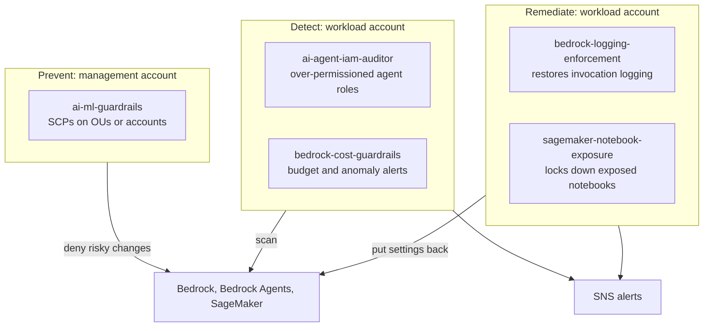

# aws-ai-guardrails

[](https://github.com/DustyStudy/aws-ai-guardrails/actions/workflows/lint-and-scan.yml)
[](LICENSE)
[](#)

Terraform guardrails for AI and ML workloads on AWS: Amazon Bedrock,
Bedrock Agents and SageMaker. Preventive SCPs, detective audits,
auto-remediation and cost controls, plus a reference deployment of the
Claude apps gateway. Every module runs in both **AWS commercial and AWS
GovCloud** (no hardcoded `arn:aws:...`; the `aws_partition` data source is
used throughout).

This repo covers the AWS infrastructure layer. For the application layer
(prompt-injection fuzzing, tool-call sandboxing and output validation for
LLM agents), see
[`ai-agent-security-toolkit`](https://github.com/DustyStudy/ai-agent-security-toolkit).

## How it fits together



The SCPs stop the risky change before it happens: turning off invocation
logging, deleting a Guardrail, calling an unapproved model, or opening a
notebook to the internet. The workload-account modules catch what an SCP
can't express and report it, or put it back. `claude-apps-gateway` is a
separate reference deployment and is not shown.

## Quickstart

Start with the preventive SCPs, attached to a sandbox OU first. Run this
from the Organizations management account (or a delegated policy admin):

```hcl
module "ai_ml_guardrails" {
  source = "github.com/DustyStudy/aws-ai-guardrails//terraform/ai-ml-guardrails?ref=v0.1.0"

  target_ids = ["ou-abcd-11111111"] # a sandbox OU, not the root
}
```

The defaults protect Bedrock logging and Guardrails and lock down SageMaker
notebooks. The model allow-list stays off until you turn it on with
`enable_restrict_bedrock_foundation_models` and your own
`allowed_bedrock_model_patterns`.

Then, in a workload account, add the read-only auditor and the cost alerts:

```hcl
module "ai_agent_iam_auditor" {
  source             = "github.com/DustyStudy/aws-ai-guardrails//terraform/ai-agent-iam-auditor?ref=v0.1.0"
  notification_email = "security@example.com"
}

module "bedrock_cost_guardrails" {
  source                   = "github.com/DustyStudy/aws-ai-guardrails//terraform/bedrock-cost-guardrails?ref=v0.1.0"
  notification_email       = "security@example.com"
  monthly_budget_limit_usd = 500
  anomaly_threshold_usd    = 50
}
```

The auditor runs daily. To run it now, after confirming the SNS email:

```bash
aws lambda invoke --function-name ai-agent-iam-auditor-audit-ai-agent-iam out.json
```

Findings arrive as one SNS summary. The auditor never changes a role.
`bedrock-logging-enforcement` and `sagemaker-notebook-exposure` do change
resources, so read their READMEs before you add them.

## Where the general AWS modules went

This repo used to be `aws-cloud-security-toolbox`, a mix of general AWS
security modules and AI/ML guardrails. The general modules moved, so each
repo now covers one area:

| Former module | Now |
|---|---|
| `auto-remediate-open-ssh-rdp`, `ec2-isolation-runbook`, `iam-credential-hygiene` | Playbooks in [`aws-remediation-orchestrator`](https://github.com/DustyStudy/aws-remediation-orchestrator) (`RevokeOpenSshRdpIngress`, `IsolateCompromisedInstance`, `DeactivateStaleAccessKeys`) |
| `wiz-finding-bridge` | [`aws-remediation-orchestrator`](https://github.com/DustyStudy/aws-remediation-orchestrator) `modules/wiz-finding-bridge`, now importing into Security Hub |
| `stale-account-detector`, `identity-center-access-auditor` | Modules in [`fedramp-terraform-library`](https://github.com/DustyStudy/fedramp-terraform-library) |
| `scp-guardrails` | [`fedramp-terraform-library`](https://github.com/DustyStudy/fedramp-terraform-library) `org-scp-boundary` and `org-governance` (IMDSv2 is the opt-in `require_imdsv2`) |
| `root-activity-alarm` | `fedramp-terraform-library` `moderate/logging-monitoring` root usage alarm |
| `security-baseline-new-accounts` | `fedramp-terraform-library` `org-cloudtrail`, `guardduty-org`, `security-hub-org`, `config-conformance-pack` |

Git history before the split still has the originals.

## Structure

```
aws-ai-guardrails/
├── terraform/
│   ├── ai-ml-guardrails/            # deploys the AI/ML SCPs below, attached to Organizations targets
│   ├── bedrock-logging-enforcement/ # scheduled check/restore of Bedrock invocation logging
│   ├── ai-agent-iam-auditor/        # detective scan for over-permissioned Bedrock/SageMaker agent roles
│   ├── bedrock-cost-guardrails/     # Budget + Cost Anomaly Detection scoped to Bedrock spend
│   ├── sagemaker-notebook-exposure/
│   │   ├── event-driven/            # EventBridge + CloudTrail, near real-time
│   │   └── config-rule/             # AWS Config + SSM Automation, catches drift
│   └── claude-apps-gateway/         # reference deployment of Anthropic's self-hosted gateway (2-phase apply)
├── policies/
│   └── ai-ml-guardrails/            # standalone AI/ML SCP JSON, usable without Terraform
└── tests/                           # pytest suites for the Lambdas
```

## Modules

| Module | Type | What it does |
|---|---|---|
| [`ai-ml-guardrails`](#ai-ml-guardrails) | Preventive | SCPs protecting Bedrock logging and Guardrails, an optional model allow-list, an optional deny of Bedrock to IAM users (LLMjacking), and SageMaker notebook lockdown |
| [`bedrock-logging-enforcement`](#bedrock-logging-enforcement) | Auto-remediation | Re-enables Bedrock invocation logging if it's disabled |
| [`ai-agent-iam-auditor`](#ai-agent-iam-auditor) | Detective | Flags over-permissioned IAM roles trusted by AI services or behind Bedrock Agent action groups |
| [`bedrock-cost-guardrails`](#bedrock-cost-guardrails) | Detective | Budget ceiling and anomaly detection on Bedrock spend |
| [`sagemaker-notebook-exposure`](#sagemaker-notebook-exposure) | Auto-remediation | Locks down SageMaker notebooks with internet or root access enabled |
| [`claude-apps-gateway`](#claude-apps-gateway) | Reference | Deployment reference for the Claude apps gateway on AWS |

### `ai-ml-guardrails`

A library of preventive Service Control Policies for AI/ML workloads:
protect Bedrock's audit trail (deny disabling invocation logging, deny
deleting Guardrails), optionally restrict Bedrock model invocation to an
allow-listed set of foundation models, optionally deny Bedrock discovery
and invocation to IAM users so leaked long-term keys can't be used for
LLMjacking, and lock down SageMaker notebook
instances (no direct internet access, no root access, VPC required, KMS
encryption required). Use the standalone JSON in
`policies/ai-ml-guardrails/`, or deploy and attach it via
`terraform/ai-ml-guardrails/`.

### `bedrock-logging-enforcement`

Checks the account's Bedrock model invocation logging configuration on a
schedule and re-enables it (to a managed S3 bucket and CloudWatch Logs
group) if it's missing or was disabled, notifying via SNS. This is the
only audit trail of what prompts/completions actually passed through
your models; pairs with `ai-ml-guardrails`'s logging-protection SCP for
a prevent-and-detect combination.

### `ai-agent-iam-auditor`

A scheduled, **detective-only** scan of every IAM role's trust policy for
AI/agent service principals (Bedrock, SageMaker, Amazon Q). Any matching
role carrying overly-broad permissions (full wildcard actions, a
service-wide wildcard on a sensitive service, or `AdministratorAccess`)
is flagged in an SNS summary. Never modifies anything: agentic workflows
often get built with broad "just in case" permissions, and an agent
steered into misusing them (via prompt injection or bad task design) has
a much larger blast radius than a human operator with the same role.

Also discovers and audits the Lambda execution roles behind every
Bedrock Agent's action groups, usually the higher-risk role of the two,
since it's what actually executes when the agent decides to act, and
it's invisible to the trust-policy scan alone (its own trust policy
names `lambda.amazonaws.com`, not Bedrock).

### `bedrock-cost-guardrails`

Guards against the most common real-world agentic AI incident: not a
breach, but an agent stuck in a loop calling itself or a tool
repeatedly, running up a large bill overnight before anyone notices. No
Lambda: combines a monthly AWS Budget (a hard, predictable ceiling on
Bedrock spend) with Cost Anomaly Detection (ML-based against your
account's own spend history, catching a spike before it reaches the
budget ceiling).

### `sagemaker-notebook-exposure`

Detects SageMaker notebook instances with **direct internet access** or
**root access** enabled, effectively an unmanaged EC2 instance with AWS
credentials attached, reachable from the internet, and remediates them.
Two-phase by necessity, since SageMaker only allows changing those
settings while a notebook is stopped:

- **`event-driven/`**: CloudTrail-triggered stop, then SageMaker's own
  "Notebook Instance State Change" event triggers the actual
  reconfiguration once the notebook has stopped.
- **`config-rule/`**: AWS Config managed rule
  (`SAGEMAKER_NOTEBOOK_NO_DIRECT_INTERNET_ACCESS`) + SSM Automation,
  catches pre-existing/drifted notebooks. Covers direct internet access
  only; there's no equivalent Config managed rule for root access yet,
  so `event-driven/` remains the only coverage for that.

### `claude-apps-gateway`

A reference deployment of the
[Claude apps gateway for AWS](https://aws.amazon.com/blogs/machine-learning/introducing-claude-apps-gateway-for-aws/):
Anthropic's self-hosted control plane that centralizes identity (via your
OIDC IdP), policy, telemetry, and spend caps for Claude Code and Claude
Desktop across an organization, routing inference to Amazon Bedrock so no
per-developer cloud credentials or long-lived secrets ever land on a
laptop. Mirrors
[Anthropic's own AWS deployment guide](https://code.claude.com/docs/en/claude-apps-gateway-on-aws)
closely: ECS Fargate, RDS for PostgreSQL (encrypted, TLS-only), Secrets
Manager, a least-privilege IAM task role scoped to exactly the Bedrock
Claude model ARNs, and an internal ALB. Deliberately split into an ECR
phase and an infrastructure phase: a single apply can't create an
empty image repository, wait for a human to push an image, and then
stand up an ECS service that needs that image to exist. A working
example for customer-managed infrastructure, not a supported production
deployment, the same caveat Anthropic's own guide gives about its `aws` CLI
walkthrough.

## CI

GitHub Actions on every push/PR:
- **Terraform**: `terraform fmt -check`, `terraform validate`,
  `terraform test`, `tflint`, Checkov
- **Python and policies**: Lambda sources compile, `policies/**/*.json`
  parses, and the unit tests in `tests/` pass
- **Security scan**: Gitleaks over the full history, and Trivy for
  vulnerable dependencies and misconfigurations (results in the Security
  tab); also runs weekly

## Tests

`terraform/ai-ml-guardrails/tests/` holds a plan-time `terraform test`
suite with a mocked AWS provider. It decodes the rendered SCP JSON and
checks the statements, and it fails if a file in
`policies/ai-ml-guardrails/` drifts from what the module renders.

`tests/` holds pytest suites for the three Lambdas:
`bedrock-logging-enforcement`, `ai-agent-iam-auditor` and
`sagemaker-notebook-exposure`. The boto3 clients are replaced with mocks,
so the tests need no AWS account. They cover what each function must and
must not touch, for example: a compliant logging config is left alone, a
role found through both a trust policy and an agent action group is
reported once, and a notebook whose update fails keeps its
pending-remediation tag.

None of these modules has been deployed against a real account yet;
treat the tests as the evidence, not a live run.
[docs/PROOF.md](docs/PROOF.md) lists what each check covers, the numbers
from the last run (including IAM Access Analyzer validation of the SCPs),
and the gaps.

```sh
terraform -chdir=terraform/ai-ml-guardrails init -backend=false
terraform -chdir=terraform/ai-ml-guardrails test
pip install pytest boto3
python -m pytest tests
```

## Contributing

PRs welcome. New modules should:
- Support both AWS commercial and GovCloud partitions
- Include a README with what it does, how it works, and deployment steps
- Pass the existing CI (lint + Checkov) before merge
