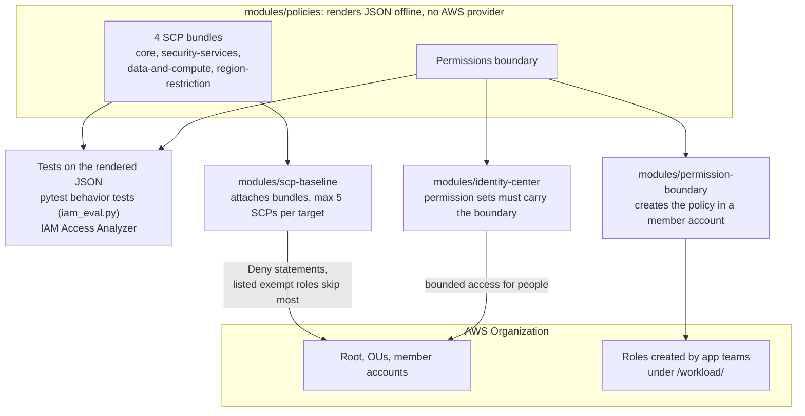
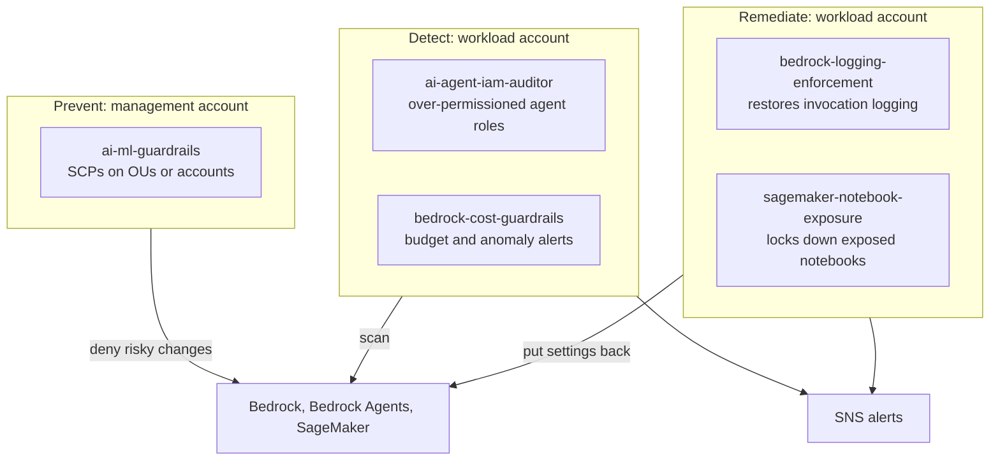

# aws-org-guardrails

[](https://github.com/DustyStudy/aws-org-guardrails/actions/workflows/ci.yml)
[](https://github.com/DustyStudy/aws-org-guardrails/actions/workflows/security-scan.yml)
[](LICENSE)

Terraform modules for AWS Organizations guardrails: service control policies,
a permissions boundary for delegated IAM, and IAM Identity Center permission
sets that carry that boundary, plus [AI and ML guardrails](#ai-and-ml-guardrails)
for Bedrock and SageMaker. Every policy is partition-aware, so the same
modules deploy to commercial regions and GovCloud.

**At a glance**

- **Problem:** SCPs and permission boundaries are JSON that fails silently. A
  typo in a condition key, a hard-coded `arn:aws:` in a GovCloud org, or a
  missing global-service carve-out does not error. It just stops protecting
  anything, or breaks IAM for everyone.
- **Approach:** render the policies from Terraform, then test them as
  *behavior*. The test suite evaluates the exact JSON Terraform produces
  against requests such as "a workload role calls `cloudtrail:StopLogging`"
  and asserts the outcome. Plan-time `terraform test` covers inputs,
  AWS limits and wiring.
- **Result:** 86 Python tests (policy behavior plus the evaluator's own
  semantics) and 30 `terraform test` runs. IAM Access Analyzer reports 0
  findings on every rendered policy in both the commercial and GovCloud
  partitions. [Deployed to a real organization and probed with 31 live API
  calls](docs/PROOF.md), all matching, after the live run exposed two defects
  the static checks missed. The module tests run against the
  oldest and newest supported Terraform on every push. Mutation checks confirm
  the suite catches an inverted exemption, a hard-coded partition, an
  unscoped IMDSv2 rule and a missing global-service carve-out
  ([details](docs/DESIGN.md#how-the-tests-were-checked)).

## How it fits together



The tests run against the exact JSON Terraform will deploy, so a broken
condition key or a hard-coded partition fails CI before anything is
attached.

## Modules

| Module | What it does |
|--------|--------------|
| [`policies`](modules/policies) | Renders the SCP bundles and the permissions boundary as JSON. No provider and no resources, so it can be tested offline. |
| [`scp-baseline`](modules/scp-baseline) | Creates the SCP bundles and attaches them to roots, OUs or accounts. Refuses to plan past the AWS limit of 5 SCPs per target. |
| [`permission-boundary`](modules/permission-boundary) | Creates the boundary policy in a member account. |
| [`identity-center`](modules/identity-center) | Permission sets, policy attachments, boundaries and group assignments. Refuses a permission set with no boundary unless it is explicitly exempted. |

## What the guardrails enforce

Four SCP bundles, so FullAWSAccess still fits in the 5-per-target limit.
Every statement is a Deny. Most carry an exemption for a short list of roles
(break-glass and the security pipeline) so the owners can still repair what
the guardrail protects.

| Bundle | Statement | Exempt roles apply? |
|--------|-----------|:---:|
| `core` | Deny `organizations:LeaveOrganization` | No |
| | Deny region opt-in and opt-out | Yes |
| | Deny everything to the member account root user | No |
| | Deny creating or changing protected roles (`OrganizationAccountAccessRole`, `security-*`); every exempt role must be protected | Yes |
| | Deny creating IAM users, access keys and console passwords (optional) | Yes |
| `security-services` | Deny stopping or changing CloudTrail and AWS Config recording | Yes |
| | Deny disabling GuardDuty (including suppression filters), Security Hub and Access Analyzer | Yes |
| `data-and-compute` | Deny disabling EBS encryption by default | Yes |
| | Deny changing the account-level S3 Block Public Access | Yes |
| | Deny launching instances without IMDSv2 | No |
| | Deny changing instance metadata options on running instances | Yes |
| | Deny RAM resource shares that allow principals outside the organization, and adding to existing ones | Yes |
| `region-restriction` | Deny regional services outside `allowed_regions` (global services carved out; optional) | Yes |

The **permissions boundary** caps what delegated principals (roles created by
application teams and pipelines) can do:

- Any role or user they create must carry the same boundary.
- They cannot remove the boundary or edit the boundary policy.
- They can only create, change or `PassRole` roles under a delegated path (`/workload/` by default).
- They can only create service-linked roles for a listed set of services.
- Organizations and account settings are out of bounds.

The boundary contains no account IDs (resource ARNs use `*`, and the
boundary check uses `${aws:PrincipalAccount}`), so one rendered document
works in every account.

## Usage

```hcl
module "scp_baseline" {
  source = "github.com/DustyStudy/aws-org-guardrails//modules/scp-baseline?ref=v0.2.1"

  target_ids = ["ou-ab12-cdefgh34"]
  exempt_principal_arns = [
    "arn:aws:iam::*:role/security-breakglass",
    "arn:aws:iam::*:role/security-pipeline",
  ]
  allowed_regions = ["us-east-1", "us-west-2"]
}
```

Full examples:

- [`examples/commercial`](examples/commercial): SCPs, the boundary in a member account, and bounded Identity Center permission sets.
- [`examples/govcloud`](examples/govcloud): the same guardrails in `aws-us-gov`.

**Roll out carefully.** An SCP applies to every principal in the target at
once. Attach bundles to a sandbox OU first, confirm the exempt roles exist in
every account, and only then move up to production OUs. SCPs never apply to
the management account, so keep workloads out of it.

## Testing

```sh
# Policy behavior tests and AI/ML Lambda tests (needs terraform on PATH;
# no AWS credentials, boto3 clients are mocked)
pip install -r requirements-dev.txt
pytest

# Module tests (mocked AWS provider; no credentials)
cd modules/scp-baseline && terraform init -backend=false && terraform test

# Optional: ask IAM Access Analyzer to validate the rendered policies
pip install -r requirements-validate.txt
python scripts/validate_policies.py
```

The behavior tests run on a small evaluator in
[`guardrails_tools/iam_eval.py`](guardrails_tools/iam_eval.py). It supports
only the IAM features these policies use and raises on anything else, so a
new statement cannot pass a test because the evaluator skipped part of it.
Its own semantics are pinned down in
[`tests/test_iam_eval.py`](tests/test_iam_eval.py).

CI also runs `terraform fmt`, `terraform validate`, TFLint, ruff, Checkov,
Trivy and Gitleaks.

## Status and limits

- **Live-tested in the commercial partition** on a sandbox OU (see
  [docs/PROOF.md](docs/PROOF.md) for what was and was not covered). GovCloud
  is validated with Access Analyzer but not deployed. Access Analyzer and the
  live probes are not part of CI yet, because they need AWS credentials.
- SCPs do not restrict service-linked roles or the management account.
- The evaluator models one policy layer. It does not model the SCP
  inheritance chain, resource policies or session policies.
- Resource control policies (RCPs) and declarative policies are not covered
  yet. See [docs/DESIGN.md](docs/DESIGN.md) for the roadmap and the reasoning
  behind each design choice, and [docs/CONTROLS.md](docs/CONTROLS.md) for the
  NIST SP 800-53 Rev5 mapping.

## AI and ML guardrails

Preventive SCPs, detective audits, auto-remediation and cost controls for
Amazon Bedrock, Bedrock Agents and SageMaker. These came from the
now-archived `aws-ai-guardrails` repo, history included.



The SCPs stop the risky change before it happens: turning off invocation
logging, deleting a Guardrail, calling an unapproved model, or opening a
notebook to the internet. The workload-account modules catch what an SCP
can't express and report it, or put it back. `claude-apps-gateway` is a
separate reference deployment and is not shown.

| Module | Type | What it does |
|---|---|---|
| [`ai-ml-guardrails`](modules/ai-ml-guardrails) | Preventive | SCPs protecting Bedrock logging and Guardrails, an optional model allow-list, an optional deny of Bedrock to IAM users (LLMjacking), and SageMaker notebook lockdown |
| [`bedrock-logging-enforcement`](modules/bedrock-logging-enforcement) | Auto-remediation | Re-enables Bedrock invocation logging if it's disabled |
| [`ai-agent-iam-auditor`](modules/ai-agent-iam-auditor) | Detective | Flags over-permissioned IAM roles trusted by AI services or behind Bedrock Agent action groups |
| [`bedrock-cost-guardrails`](modules/bedrock-cost-guardrails) | Detective | Budget ceiling and anomaly detection on Bedrock spend |
| [`sagemaker-notebook-exposure`](modules/sagemaker-notebook-exposure) | Auto-remediation | Locks down SageMaker notebooks with internet or root access enabled |
| [`claude-apps-gateway`](modules/claude-apps-gateway) | Reference | Deployment reference for the Claude apps gateway on AWS |

Each module's README covers its inputs and deployment. The standalone SCP
JSON in [`policies/ai-ml-guardrails/`](policies/ai-ml-guardrails) works
without Terraform. What is and isn't verified: [docs/PROOF-AI-ML.md](docs/PROOF-AI-ML.md).

## License

[MIT](LICENSE)
